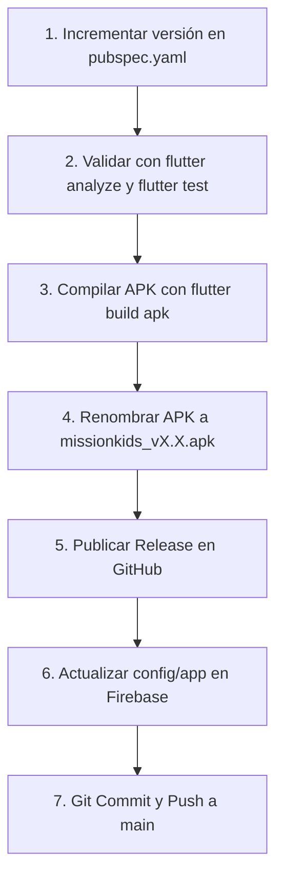

# 🚀 Guía de Flujo de Trabajo para Nuevas Versiones (Releases)

Esta guía describe el procedimiento paso a paso que debes seguir cada vez que compiles y publiques una nueva versión de **Mission Kids**.

---

## 📋 Resumen del Ciclo de Publicación



---

## 🛠️ Paso a Paso Detallado

### 1. Actualizar la versión en `pubspec.yaml`

Abre [pubspec.yaml](file:///c:/Users/yhoba/MisProyectos/josue_tareas/pubspec.yaml) y localiza la línea `version:` (cerca de la línea 4):

```yaml
version: 1.4.0+4
```

* **Antes del signo `+` (`1.4.0`)**: Es la versión visible para el usuario (`latest_version`). Usa [Versionado Semántico](https://semver.org/lang/es/):
  * `1.3.1`: Si solo fueron correcciones menores de errores (hotfix).
  * `1.4.0`: Si agregaste nuevas funciones o pantallas.
  * `2.0.0`: Si es un cambio total de la app.
* **Después del signo `+` (`4`)**: Es el `build number` (código entero incremental). Debe ser mayor al anterior (1, 2, 3, 4...).

---

### 2. Validar Calidad del Código (Pruebas Locales)

Para asegurarte de que GitHub Actions no falle ni te lleguen correos de error:

1. **Revisar advertencias y linter:**
   ```bash
   flutter analyze
   ```
   *Debe responder `No issues found!`.*

2. **Ejecutar pruebas unitarias:**
   ```bash
   flutter test
   ```
   *Debe responder `All 25 tests passed!`.*

---

### 3. Compilar el APK de Producción

> [!NOTE]
> **No necesitas conectar ningún dispositivo físico ni emulador** para compilar.

Ejecuta en tu terminal PowerShell:

```bash
flutter build apk --release --no-tree-shake-icons
```

> **¿Por qué usamos `--no-tree-shake-icons`?**  
> Porque la aplicación permite seleccionar iconos dinámicos para las tareas y hábitos desde el código; esta bandera asegura que ningún icono se omita accidentalmente al optimizar el APK.

---

### 4. Localizar y Renombrar el APK

Una vez finalizada la compilación exitosa:
* **Ubicación del archivo:**
  ```text
  build\app\outputs\flutter-apk\app-release.apk
  ```
* **Renombrar según el estándar de Mission Kids:**
  Copia o renombra el archivo a tu convención de releases:
  ```text
  missionkids_v1.4.apk
  ```

---

### 5. Publicar la Release en GitHub

1. Ingresa a tu repositorio en GitHub:
   👉 **[GitHub Releases - Mission Kids](https://github.com/a8abhinav02-lgtm/MisionKids/releases)**
2. Haz clic en **Draft a new release**.
3. Configura los campos:
   * **Tag:** `v1.4.0` (o `v1.4`) ➔ Selecciona *Create new tag*.
   * **Target:** `main`.
   * **Release title:** Ej: `Mission Kids v1.4.0 - Nuevas Funciones y Mejoras`.
   * **Describe this release:** Describe brevemente los cambios para los usuarios y tutores.
4. **Adjunta el archivo APK:**
   * Arrastra o sube `missionkids_v1.4.apk` en la caja de *Attach binaries*.
5. Haz clic en **Publish release**.
6. **Copia el enlace de la release o del APK:**
   * Haz clic derecho sobre el archivo APK adjunto y selecciona *Copiar dirección del enlace*.

---

### 6. Actualizar Firebase Firestore (`config/app`)

Para que los usuarios que tengan instalada la versión anterior reciban la ventana emergente que les sugiere actualizar:

1. Ingresa a la consola de [Firebase Console](https://console.firebase.google.com/).
2. Ve a **Firestore Database** ➔ Colección **`config`** ➔ Documento **`app`**.
3. Actualiza los siguientes campos:

| Campo | Tipo | Ejemplo de Valor | Descripción |
| :--- | :--- | :--- | :--- |
| `latest_version` | `string` | `"1.4.0"` | Debe coincidir exactamente con la versión de `pubspec.yaml`. |
| `update_url` | `string` | `"https://github.com/.../releases/..."` | El link del release o APK en GitHub. |
| `release_notes` | `string` | `"¡Nuevas misiones y mejoras de rendimiento disponibles!"` | Mensaje que se mostrará en el diálogo infantil. |
| `force_update` | `boolean` | `false` | `false`: permite cerrar el diálogo y seguir usando la app.<br>`true`: bloquea la app hasta que actualicen (para cambios críticos). |

> [!TIP]
> En cuanto guardes el documento en Firebase, la próxima vez que cualquier usuario con una versión menor (ej. `1.3.0`) abra la app, le aparecerá automáticamente la ventana de sugerencia de actualización.

---

### 7. Guardar y Subir los Cambios en Git

Por último, registra los cambios de versión en el repositorio:

```powershell
git add pubspec.yaml
git commit -m "chore(release): bump version to 1.4.0"
git push origin main
```

---

## ❓ Preguntas Frecuentes y Solución de Problemas

### ¿Qué hago si GitHub me envía un correo diciendo que el workflow falló?
GitHub Actions ejecuta `flutter analyze` y `flutter test` en la nube. Si recibes un correo de fallo:
1. Revisa tu terminal ejecutando `flutter analyze`. Si hay algún `warning` o `unused_import`, elimínalo.
2. Haz `git commit` y `git push` para que vuelva a correr en verde.

### ¿Qué pasa si el diálogo de actualización no aparece en el celular?
1. Verifica que la versión instalada en el celular sea menor que la indicada en `latest_version` de Firestore.
2. Si el usuario ya presionó *"Más tarde"*, el sistema espera 24 horas para volver a sugerirlo (a menos que `force_update` sea `true`). Para probarlo inmediatamente, puedes borrar datos/caché de la app o desinstalar y reinstalar la versión anterior.
