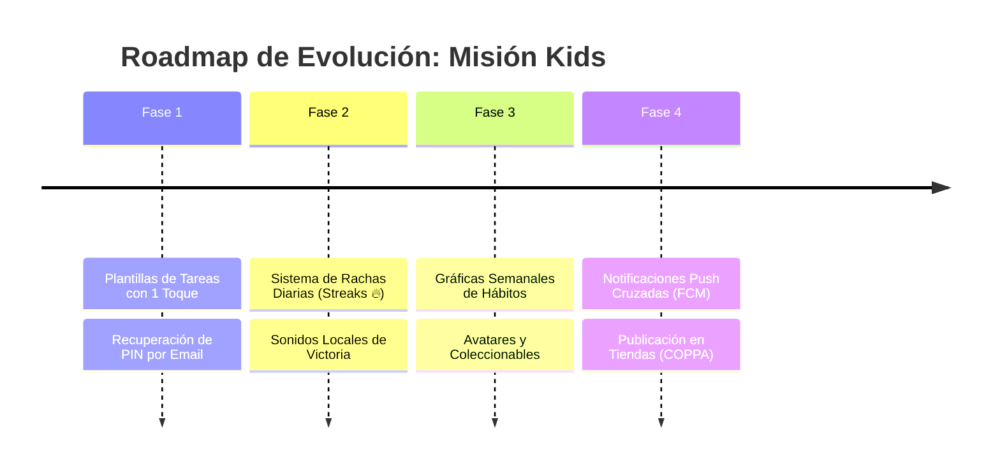

# 🧭 Estrategia de Desarrollo Futuro: Misión Kids 🚀

**Fecha de elaboración:** Septiembre 2026  
**Estado actual del proyecto:** Base arquitectónica consolidada (MVVM / Provider), persistencia híbrida (Hive + Firebase Firestore / Auth), CI en GitHub Actions 100% en verde, actualización a Gradle 9.1 / AGP 9.0.1 / Kotlin 2.3.20, sistema de calificación (1-5 estrellas) y Onboarding multimedia contextual integrado tanto para Web como para Android.

---

## 🎯 Visión General

Con la infraestructura y las mecánicas base totalmente funcionales y verificadas, la siguiente etapa de **Misión Kids** debe centrarse en maximizar la **retención de los niños**, **reducir el esfuerzo operativo de los padres** y **preparar el aplicativo para su eventual publicación y escalabilidad en tiendas oficiales (Google Play Store / Web PWA)**.

A continuación se detallan las **4 Líneas Estratégicas de Desarrollo Futuro**, diseñadas para evolucionar el producto de forma iterativa y modular.

---

## 🌟 1. Gamificación y Retención Infantil (Experiencia del Niño)

> **Objetivo:** Prevenir el abandono (*churn*) pasadas las primeras 2-3 semanas, transformando la rutina diaria en un juego de superación personal que genere entusiasmo y orgullo en el niño.

### A. Sistema de Rachas Diarias (*Daily Streaks* 🔥)
* **Concepto:** Un contador visible en el encabezado del niño que contabiliza días consecutivos completando todas las misiones clave:
  - *Día 3:* "¡Racha de 3 días! Medalla de Bronce 🥉".
  - *Día 7:* "¡Una semana imparable! Racha de Fuego 🔥 (+20 pts de bonificación)".
* **Impacto psicológico:** Fomenta el compromiso diario; el niño no quiere "perder su racha", lo que afianza los hábitos matutinos y nocturnos.
* **Aspectos técnicos:** Cálculo ligero basado en `ultimoDiaCompletado` y comparación de fechas consecutivas en `Perfil` y `TareaProvider`.

### B. Coleccionables y Avatares Desbloqueables
* **Concepto:** Permitir que el niño invierta pequeñas cantidades de estrellas en personalizar su perfil:
  - Marcos dorados, espaciales o ninja para su avatar.
  - Insignias de honor (*"El Madrugador"*, *"Guerrero del Orden"*, *"Lector Maestro"*).
  - Nuevos temas visuales (*Dinosaurios, Superhéroes, Naturaleza*).
* **Impacto:** Dota a las estrellas de una utilidad lúdica inmediata dentro de la app, complementando las recompensas físicas o de largo plazo que definen los padres.

### C. Feedback Sonoro y Microinteracciones Sensoriales
* **Concepto:** Integrar efectos sonoros locales con baja latencia (a través de `SoundService` y `assets/sounds/`):
  - Sonido alegre al tocar "Misión Cumplida".
  - Fanfarria de victoria cuando el confeti estalla al alcanzar la meta de ahorro.
* **Impacto:** Refuerzo dopaminérgico positivo inmediato cada vez que el niño cumple con una responsabilidad.

---

## ⚡ 2. Reducción de Fricción para Padres (Experiencia del Tutor)

> **Objetivo:** Eliminar la fatiga de configuración. Los padres suelen tener agendas apretadas; la app debe permitirles organizar la semana en menos de 2 minutos.

### A. Catálogo de Plantillas de Tareas Rápidas (1 Toque)
* **Concepto:** Un carrusel de tareas sugeridas preconfiguradas con iconos, bloques y puntajes recomendados por rango de edad:
  - 🛏️ **Tender la cama** (Mañana • Obligatoria • 5 pts)
  - 🦷 **Lavarse los dientes 2 min** (Mañana/Noche • Obligatoria • 5 pts)
  - 📚 **Hacer deberes escolares** (Tarde • 15 pts)
  - 🧸 **Ordenar habitación/juguetes** (Noche • 10 pts)
  - 🍎 **Comer frutas y verduras** (Tarde • 5 pts)
* **Impacto:** El padre no tiene que pensar textos ni buscar códigos de iconos; toca una tarjeta y la misión queda asignada al instante.

### B. Gráficas de Hábitos y Analíticas Semanales
* **Concepto:** Una pestaña analítica dentro de la zona de padres con métricas sencillas:
  - **Tasa de cumplimiento:** Gráfico circular o de barras (% de misiones logradas por semana).
  - **Mapa de calor horario:** Identificar en qué bloque del día el niño muestra más resistencia (¿Mañana, Tarde o Noche?) para ayudar a los padres a ajustar las expectativas familiares.
* **Impacto:** Brinda valor tangible a los padres mostrando el progreso conductual real a lo largo de las semanas.

---

## 🔔 3. Conexión Familiar y Notificaciones Cruzadas

> **Objetivo:** Vincular las acciones entre padres e hijos en tiempo real, cerrando la brecha de comunicación entre el cumplimiento de la tarea y su aprobación.

### A. Alertas Push Cruzadas en Tiempo Real
* **Flujo Hijo ➡️ Padre:**
  - Cuando el niño pulsa *"Misión Cumplida"*, el teléfono del padre recibe una notificación inmediata:
    > *🔔 "¡Josué ha completado 'Hacer los deberes'! Toca para revisar y aprobar."*
* **Flujo Padre ➡️ Hijo:**
  - Cuando el padre aprueba la tarea o añade saldo:
    > *⭐ "¡Misión aprobada! Se han sumado 15 estrellas a tu alcancía."*
* **Impacto:** Elimina la necesidad de que el padre revise manualmente la app para enterarse de que hay tareas esperando revisión, y el niño recibe retroalimentación inmediata por su esfuerzo.

---

## 🛡️ 4. Seguridad, Robustez y Preparación para Producción

> **Objetivo:** Garantizar que el aplicativo cumpla con los estándares técnicos y legales requeridos para su distribución pública en Google Play Store, App Store y Web.

### A. Recuperación Segura de PIN de Padres
* **Concepto:** Incorporar un flujo *"¿Olvidaste tu PIN?"* en el diálogo de acceso a la administración.
* **Mecanismo:** Envío de un enlace o código de restablecimiento al correo del padre registrado en Firebase Auth, previniendo que una familia quede bloqueada fuera del panel de control si olvida sus 4 dígitos.

### B. Cumplimiento de Políticas de Menores (COPPA / Google Play Families)
* **Concepto:** Adaptar el proyecto a las exigencias estrictas de las tiendas de aplicaciones para software dirigido a familias y niños:
  - Pantalla o enlace a la **Política de Privacidad** que declare explícitamente que los datos de los niños permanecen confinados al entorno familiar privado y no se transfieren a terceros con fines publicitarios.
  - Puertas parentales (*Parental Gates*) en cualquier enlace saliente o canal de retroalimentación.

### C. Modo Offline Resiliente y Sincronización en Segundo Plano
* **Concepto:** Reforzar la persistencia en Hive para que si el niño está en un viaje o sin conexión a internet, pueda seguir registrando sus hábitos normalmente. Al reconectarse a Wi-Fi, la app sincroniza en segundo plano con Firestore sin conflictos de versiones.

---

## 📊 Matriz de Priorización y Tabla Comparativa

| Línea / Funcionalidad | Impacto en el Usuario | Esfuerzo Técnico | Complejidad | Retorno de Valor | Prioridad Sugerida |
| :--- | :--- | :--- | :--- | :--- | :--- |
| **Plantillas de Tareas Rápidas (1 Toque)** | **Muy Alto** (Padres) | 🟢 Bajo (1 - 2 días) | 🟢 Baja | ⚡ Inmediato | **1. Alta (Inmediata)** |
| **Sistema de Rachas Diarias (Streaks 🔥)** | **Muy Alto** (Niños) | 🟡 Medio (2 - 3 días) | 🟡 Media | 📈 Retención sostenida | **2. Alta (Inmediata)** |
| **Recuperación de PIN por Correo** | **Alto** (Seguridad) | 🟢 Bajo (1 día) | 🟢 Baja | 🛡️ Tranquilidad operativa | **3. Media (Corto Plazo)** |
| **Feedback Sonoro Local al Cumplir Misión** | **Medio / Alto** (Niños) | 🟢 Bajo (1 día) | 🟢 Baja | 🎮 Sensación de juego | **4. Media (Corto Plazo)** |
| **Gráficos Semanales de Cumplimiento** | **Alto** (Padres) | 🟡 Medio (2 - 3 días) | 🟡 Media | 📊 Insights familiares | **5. Media (Mediano Plazo)** |
| **Avatares y Temas Desbloqueables** | **Alto** (Niños) | 🟡 Medio (3 - 4 días) | 🟡 Media | 💎 Economía de estrellas | **6. Media (Mediano Plazo)** |
| **Alertas Push Cruzadas (FCM / Cloud Functions)** | **Muy Alto** (Ambos) | 🔴 Alto (4 - 5 días) | 🔴 Alta | 🚀 Experiencia en vivo | **7. Estratégica (Fase Avanzada)** |
| **Auditoría COPPA / Política de Privacidad** | **Crítico** (Para Stores) | 🟢 Bajo (1 - 2 días) | 🟢 Baja | 🌐 Publicación formal | **8. Pre-Lanzamiento** |

---

## 🗺️ Hoja de Ruta Sugerida (Roadmap)

---

*Documento disponible en el repositorio raíz como referencia para la planificación y priorización de las siguientes ramas de desarrollo.*
